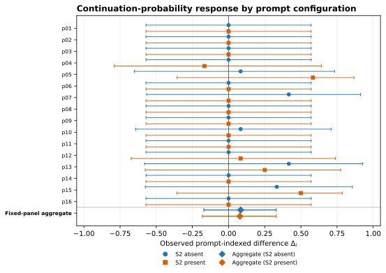
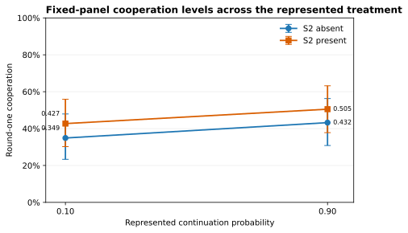
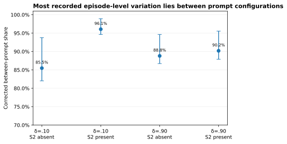
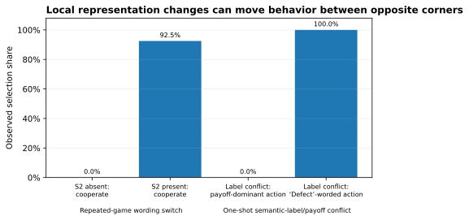
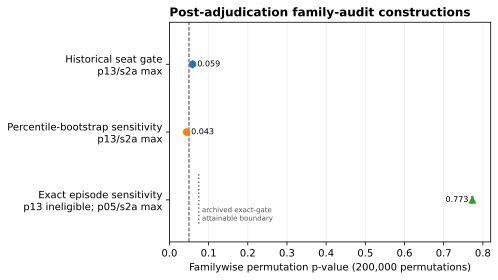

# Passing Coarse Marginal Checks Can Be Cheap: Persona Mixtures and Imprecise Treatment-Response Estimates in an LLM Persona Panel

**STATUS: WORKING DRAFT v8 — INDEPENDENT REPOSITORY REVIEW DRAFT, NOT FOR CITATION.** This revision incorporates the completed zero-call submission analyses, direct outside reproduction of the 4,576-run capsule, and Round 4 editorial review. Every sealed registration, adjudication, report, and precommitted discussion artifact remains unchanged. §5.2 quotes an exact excerpt of discussion text sealed and externally timestamped before the final experiment's data existed (sha `1f1d7de9…e356`); the full sealed text remains in the supplement and is not edited. Draft history, review records, generated figures, and the correction ledger are public in the repository.

**Author:** Yohei Nakajima (Untapped Capital). Experiments executed by an autonomous pipeline (Replit Agent + ActiveGraph event-sourced engine). Attribution and reviewer-role disclosure: §8.

**Artifacts (public):** github.com/yoheinakajima/synthetic-players — anonymous clone + one-command zero-credential verifier; 4,576/4,576 Phase 4–5 runs replay byte-exact; registries hashed and externally anchored (GitHub timestamps + OpenTimestamps/Bitcoin).

---

## Abstract

Large language models are increasingly used as synthetic research participants, but they are often validated by whether their marginal responses resemble published human data. We report a five-stage research program. Confirmatory claims from Phases 3–5 were registered before the data that adjudicated them and were mechanically evaluated from an event-sourced record; Phases 1–2 document post hoc instrument development and corrective re-adjudication rather than prospective confirmation. A fixed panel of sixteen lightweight persona-conditioned GPT-4.1 configurations passed preregistered broad-reference checks for condition-level cooperation in three of four repeated-game cells. Correcting raw cross-persona dispersion for finite episode counts leaves estimated between-prompt standard deviations of 0.418–0.478 and attributes approximately 85%–96% of episode-level variation to differences between prompt configurations. The observed aggregate continuation-probability contrasts are +0.083 and +0.078 across two wording families, but conservative exact simultaneous intervals are approximately [−0.171, +0.330] and [−0.181, +0.330]. The point estimates are small on the unit scale; the uncertainty is too wide to establish equivalence, a null response, or a narrow upper bound. Cell-level boundary classification is also method-sensitive: the historical seat-level rule classified 14/96 cells interior, a conservative exact episode-level interval classified 11/96, and a Dirichlet–Jeffreys sensitivity classified 19/96. Separate representation experiments showed that one continuation sentence shifted cooperation from 0/40 to 37/40 on held-out decisions and that semantic action labels could override payoff dominance in a registered conflict condition. Together, the findings identify a concrete failure mode: coarse marginal checks can be satisfied largely through composition across prompt-conditioned policies that are highly concentrated within recorded cells, while the observed lever response has small point estimates and substantial uncertainty. External review later exposed family-error and dependence defects; post-adjudication sensitivities changed the scientific interpretation without rewriting the historical record. Human references are published and protocol-nonmatched, the results concern one fixed model–persona panel, and we do not claim human substitutability.

## 1. Introduction

Human behavioral experiments are slow and expensive; LLM calls are fast and nearly free. A growing literature reports that suitably conditioned LLMs produce data resembling human data—“algorithmic fidelity” [Argyle et al. 2023], “homo silicus” [Horton 2023], behavior “statistically indistinguishable from a random human” [Mei et al. 2024]—and a formal framework for evaluating *statistical realism* now exists [Xie et al. 2026]. Much of this evidence validates marginals: means, distributions, and aggregate replication.

Recent work shows that descriptive realism and causal fidelity can diverge at scale [Li & Ji 2026], that treating LLM outcomes as surrogates for human outcomes requires assumptions that marginal equivalence does not supply [Persson et al. 2026], and that intervention prompts can shift a model’s implied latent user even when explicit persona text is fixed [Lin et al. 2026]. Li and Ji additionally trace effect errors to intervention logic, outcome structure, and excessive attitude–behavior coupling, so the present paper does not claim mechanism-level explanation in general. Its narrower contribution is a specific fixed-panel composition mechanism in incentive-bearing strategic interaction, coupled to minimal representation interventions and an auditable correction record. We decompose the explicit persona panel into between-prompt dispersion, within-prompt variation, and prompt-indexed treatment response. The panel passes coarse marginal checks while producing small but imprecisely estimated continuation-probability contrasts, and most recorded variation lies between prompt configurations rather than within them. Sealed templates and matched procedures control explicit assignment, environment randomization, and execution. They do not establish latent-person invariance; Lin-style user drift and the observed composition pattern can coexist.

**Contributions.** First, we provide a registered strategic-interaction example in which a fixed persona panel passes coarse condition-level and variance checks while producing aggregate continuation-probability point differences of +0.083 and +0.078; exact dependence-aware intervals show that these estimates remain compatible with materially larger positive or negative effects and do not establish equivalence (§4.1). Second, we identify and formalize the associated composition problem: corrected variance estimates place 85%–96% of episode-level variation between prompt configurations, the binary boundary census is interval-method-sensitive, and aggregate moments do not identify microstructure or cross-condition response coupling; representation experiments further show how wording and semantic labels govern the induced policies (§4.1–4.3). Third, we demonstrate an auditable reliability protocol—and its limit—through prospectively registered confirmatory claims, external chronology, exact replay, mechanical adjudication, and a public post-adjudication correction in which outside review overturns the favored persona-level interpretation without altering the frozen record (§4.4–4.5).

## 2. Related work

**Occupied territory, and where we sit.** Li and Ji [2026] establish across three model families, eleven interventions, and 59,508 participants that descriptive fit and intervention-effect accuracy can diverge, that prompt refinements improving realism do not reliably improve effect accuracy, and that errors vary with intervention logic, outcome structure, and attitude–behavior coupling. Persson, Schultzberg, and Ankargren [2026] formalize when LLM outcomes can serve as causal surrogates and why novel interventions still require human evidence. Lin et al. [2026] show that interventions can change the implicit simulated population even when explicit personas are fixed. Statistical-realism, persona-collapse, and state-versus-trait work further show that persona-conditioned populations can compress or misallocate heterogeneity [Xie et al. 2026; Harry et al. 2026; Xiao et al. 2026]. Our differentiation is therefore not the broad divergence or the existence of mechanisms. It is a registered decomposition of one common lightweight construction in strategic interaction: the same fixed explicit prompt panel is evaluated for marginal fit, finite-opportunity-corrected between/within composition, representation sensitivity, and response to a represented continuation-probability treatment, with exact prompt provenance and public inferential correction. The observed composition pattern is complementary to, not exclusive of, latent-user drift.

**LLM strategic behavior.** Akata et al. [2025] characterize repeated-game play modulated by prompts; Pal et al. [2026] elicit strategies from five models while varying continuation probability, payoffs, horizon knowledge, and framing; counterfactual-reasoning evaluations alter labels and payoff structures [Georgousis et al. 2026]; and “strategic robustness” has been defined as payoff-preserving invariance across narratives [Mousavi Davoudi et al. 2026]. These works establish that neither repeated games nor prompt/payoff perturbations are new. Our distinct combination is the fixed persona panel, the explicit between/within/response decomposition, exact prompt provenance, prospective registration of confirmatory claims, and mechanical adjudication followed by public inferential correction.

**Strong positive evidence, and a different estimand.** Ashokkumar, Hewitt, Ghezae, and Willer [2026] use study descriptions to forecast 469 effects from 70 preregistered, nationally representative survey experiments and find strong correlations with realized effects, alongside systematic effect-size overestimation and weaker performance in a megastudy archive. That is important contrary evidence against any blanket pessimism about LLMs in experimental science. It is also a forecasting task over studies rather than subject-level simulation of a response surface. Strong effect forecasting is compatible with the fixed-panel composition failure studied here and reinforces the prescription to validate a simulator on the exact response object for which it will be used.

**Synthetic participants and personas.** Bisbee et al. [2024] find plausible survey averages alongside compressed variance, distorted coefficients, and temporal drift; Boelaert et al. [2025] report excess homogeneity; Anthis et al. [2025] catalog diversity and generalization challenges; Hullman et al. [2026] propose statistical calibration for confirmatory use; and Park et al. [2024] show that rich interview conditioning can substantially outperform lightweight demographic/persona descriptions. Format sensitivity [Sclar et al. 2024], role-play framing [Shanahan et al. 2023], persona collapse [Xiao et al. 2026], state blindness [Harry et al. 2026], and reviews of persona-experiment transparency [Batzner et al. 2025] all caution against treating a persona string as a stable human analogue. RLHF-related diversity reduction is a possible mechanism for concentrated policies, not a mechanism identified by this design. Full map: `docs/analysis/literature-map.md`; differentiation table: `docs/analysis/novelty-relationships.md`.

## 3. Instrument and inferential units

The primary deployment is gpt-4.1 at temperature 0.7 with 16-token outputs and a fixed minimal behavioral-subject prompt containing no game-theory vocabulary or reasoning scaffold. Phase 5 prepends one sealed persona sentence to byte-identical task text, giving every persona cell an exact bare twin. The cross-vendor Gemini tier is descriptive; the original Claude Haiku candidate failed a registered entry gate and was replaced under an archived amendment. Environment randomness is seeded; provider-side generation is not claimed to be seeded. Every request, rendered prompt, completion, decoding configuration, round, and provenance record is archived.

### 3.1 Sequential architecture and registration status

| Stage | Primary question and role | Unit used in the paper | Registration status |
|---|---|---|---|
| Phase 1 | Initial prototype and naive behavioral claims; establishes the historical baseline, not current confirmatory evidence | provider calls / recorded decisions | post hoc instrument development |
| Phase 2 | Mechanical re-adjudication and enforcement repair after the initial harness exposed analyst discretion | archived runs and claim predicates | corrective, not prospective confirmation |
| Phase 3 | Bare GPT-4.1 configuration in repeated PD, framing, and RPS | episode, with historical seat-level summaries disclosed | claims registered before Phase 3 data |
| Phase 4 | Representation robustness, X1/X2 wording extensions, counterfactual payoffs/labels, continuation-probability assays, adversaries, and sentinels | complete episode for current sensitivities | X1 was a sequentially registered, result-informed extension: Phase 3 motivated the test, while its prompts, sample size, and predicate were sealed before any X1 data; the remaining blocks were registered before their own data |
| Phase 5 | Sixteen sealed persona-prefix configurations crossed with the Phase 4 instruments; descriptive Gemini tier | complete persona prompt for the fixed panel; episode beneath it | confirmatory predicates registered before Phase 5 data; post-adjudication sensitivities are explicitly unregistered |

The present paper’s main empirical decomposition is Phase 5, interpreted using representation results from Phases 3–4. Phases 1–2 document instrument evolution and are not counted as prospective confirmation.

The full event store contains 5,505 completed runs, 54,276 round events, 108,552 seat-round decisions, and 36,251 archived provider-request events. The public Phase 4–5 replay contract covers 4,576 completed runs. A separate transactional ledger records 30,530 Phase 4–5 calls, 13,141,675 input tokens, and 45,247 output tokens; it excludes earlier phases and therefore must not be conflated with the full event-store request count. Counts and definitions are reconciled in `docs/analysis/submission/count-reconciliation.md`.

Confirmatory claims were registered before the data that adjudicated them and were mechanically evaluated in a fixed vocabulary. The historical two-sided interiority rule used Clopper–Pearson bounds on seat-level round-one trials. Because two seats share an episode, the submission analysis additionally treats the complete episode as the independence unit. For an episode outcome \(Y\in\{0,0.5,1\}\), the conservative exact sensitivity writes

\[
Y=\tfrac12\{\mathbf 1(Y\ge0.5)+\mathbf 1(Y=1)\},
\]

constructs simultaneous Clopper–Pearson intervals for the two episode-level binary components, and projects them onto \(E[Y]\). This construction is conservative, does not assume seat independence, and does not collapse to zero uncertainty when all observed episodes agree. A Dirichlet–Jeffreys interval is reported as a Bayesian sensitivity. The percentile cluster bootstrap is also retained as a post-adjudication sensitivity. The exact Clopper–Pearson projection is the conservative reference because it provides finite-sample coverage for the discrete episode mean; at n=6 the percentile bootstrap has no comparable coverage guarantee and can understate uncertainty. Its degeneracy at exact corners is a symptom of that limitation, not by itself a false-positive mechanism for this strict interiority gate.

The hierarchy is deployment → explicit persona prompt → condition → episode → seat → round → provider request. Phase 5’s confirmatory unit is the complete persona sentence; name, age, occupation, and traits are bundled semantic treatments. Registered claims attach to the conditional finite-panel estimand for these sixteen prompts. Claims about a wider persona generator are exploratory at \(n=16\). Pairing the same explicit prompt across conditions identifies a prompt-indexed contrast, not necessarily a stable latent person’s treatment effect.

**Protocol glossary.** `S2-absent` and `S2-present` are the two registered repeated-game wording families: the latter includes the switch-bearing continuation sentence localized in X2, while the former omits that sentence. `P5-1a` is the registered fraction of selected persona–condition cells classified interior, with support for the corner-mixture predicate when that fraction is below 0.10; `P5-1b` is the registered between-persona dispersion comparison. `P5-2` pools registered conflict cells and classifies whether choices follow task text or persona-conditioned direction. `P5-3(a)`—called clause (a) below—asks whether any persona × wording pair has both continuation-probability cells interior and a positive slope lower bound; `P5-3(b)`—clause (b)—asks whether each persona lane rejects the bare configuration’s dominated, semantically attracted swap-cell option at a registered minimum rate. Historical alphanumeric verdicts remain visible even where post-adjudication sensitivities change their scientific interpretation.

The machinery’s boundary is explicit:

> **The pipeline can enforce a registered predicate exactly; it cannot guarantee that the predicate represents a valid estimand, test family, or construct.**

## 4. Results

### 4.1 Coarse marginal checks pass while represented-treatment estimates remain imprecise

The preregistered leaning rule—at least two of agreeable, patient, and risk-averse—separates round-one cooperation by 0.5–0.7 in every non-swap cell. Because names, ages, occupations, and all trait descriptors vary in the complete sentence, this is a property of the registered prompts rather than a causal trait estimate. Pool means of 0.349–0.505 enter the published cooperation band in three of four repeated-game cells.

Raw cross-persona standard deviations range from 0.4241 to 0.4800. Correcting for finite episode counts leaves fixed-panel between-prompt SD estimates of 0.4182, 0.4784, 0.4408, 0.4323 across the four repeated cells. The primary bootstrap retains all sixteen registered prompts and resamples episodes within prompt; its 95% intervals are [0.4122, 0.4391], [0.4696, 0.4916], [0.4279, 0.4654], [0.4269, 0.4496]. The corrected between-prompt component accounts for 85.5%, 96.1%, 88.8%, 90.2% of total episode-level variation, with fixed-panel 95% intervals [82.0%, 93.8%], [94.6%, 98.9%], [86.7%, 94.6%], [87.9%, 95.5%]. All four fixed-panel lower bounds exceed the historical registered threshold of 0.75 times the published human SD. An exploratory two-stage bootstrap that additionally resamples prompts produces wider corrected-SD intervals of [0.2724, 0.4879], [0.3696, 0.5123], [0.3457, 0.4890], [0.3345, 0.4847]; 3/4 lower bounds exceed the historical threshold. These are fixed-panel prompt-heterogeneity estimates and exploratory persona-generator sensitivities, not matched human latent variances.

Across the represented continuation-probability treatment, the observed fixed-panel point differences are +0.083 for S2-absent wording (the registered family omitting the switch-bearing continuation sentence) and +0.078 for S2-present wording (the family including it). Conservative exact simultaneous 95% intervals are approximately [−0.171, +0.330] and [−0.181, +0.330]. The point estimates are small on the unit scale, but the intervals permit effects as large as approximately +0.33 and moderately negative effects; the experiment does not establish equivalence, a zero response, or a narrow upper bound. The treatment changes both the environment’s continuation process and the text used to communicate that process. Round-one choices therefore identify response to **continuation probability under a specified representation**, not a semantically neutral economic parameter: incentive and framing channels remain undecomposed.

Dal Bó and Fréchette [2011] remain useful only as protocol-nonmatched context: their treatments use different continuation probabilities and payoffs, monetary incentives, between-session assignment, and repeated supergames through which behavior changes with experience. Their pooled experienced contrast is substantially larger, while first-supergame ordering reverses. We make no matched magnitude or human-equivalence claim.

The registered Gemini tier was descriptive only and is excluded from these estimates because its endpoint showed documented non-stationarity. Across eight personas and three cells, recorded means ranged from 0 to 0.90 and 9/24 cells (37.5%) met the historical interiority rule, compared with 14/96 (14.6%) in the primary GPT-4.1 panel; several representation-channel effects also reversed direction across vendors. Because the endpoint was non-stationary and the evaluated panels differed, this is not a formal replication comparison. It is contrary descriptive evidence that the composition pattern is deployment-specific rather than universal. Complete values are in `docs/analysis/figure-sources/p5-tierC-gemini.csv` and the stability record.

*Figure 1. Prompt-indexed differences in round-one cooperation, \(\Delta_i=\hat p_i(\delta=.90)-\hat p_i(\delta=.10)\), for both registered wording families. Bars are conservative exact simultaneous 95% intervals with complete episodes as the unit; observed corners retain non-zero uncertainty. Diamonds on the **Fixed-panel aggregate** row show the two wording-family estimates in their corresponding series colors. Many rows at \(\Delta_i=0\) arise because both recorded cells were fully concentrated at the same boundary; they visualize the composition pattern, not precise evidence of homogeneous response or no effect. Pairing the same explicit prompt supplies a prompt-indexed coupling, not a person-level treatment effect without latent-person invariance.*

*Figure 2. Fixed-panel round-one cooperation by represented continuation-probability condition and wording family. Points are observed means; error bars are the conservative exact condition intervals used in the within-wording contrast construction. Lines connect conditions for orientation only and do not imply a precise, semantically isolated incentive effect.*

*Figure 3. Finite-opportunity-corrected share of episode-level variation assigned to differences between prompt configurations in each repeated-game cell. Error bars are fixed-panel episode-bootstrap 95% intervals. The separate prompt-resampling analysis is wider and remains exploratory for persona-generator inference.*

The historical seat-level interiority rule classified 14/96 persona–condition cells as interior and 3/32 in the restricted P5-1a set, just below the registered 0.10 threshold. The conservative exact episode-level interval classifies 11/96 and 2/32. A Dirichlet–Jeffreys sensitivity classifies 19/96 and 5/32, which would fail the historical threshold. Thus the binary verdict is not invariant to interval construction. The more stable result is continuous: the corrected decomposition assigns a large majority of observed episode-level variation to differences between prompt configurations, while the observed aggregate continuation-probability point differences remain small and imprecisely estimated.

### 4.2 What the marginal checks cannot identify

Let \(p_i(d)=E[Y\mid i,d]\), where \(i\) indexes the complete explicit persona prompt and \(d\) the experimental condition.

**Proposition A: broad bands only partially identify the aggregate contrast.** If a synthetic condition mean is accepted within tolerance \(\epsilon_d\) of a reference mean in each condition, then

\[
|\Delta^S-\Delta^H|\le \epsilon_0+\epsilon_1.
\]

Equivalently, accepted bands \([\ell_0,u_0]\) and \([\ell_1,u_1]\) imply only

\[
\Delta^S\in[\ell_1-u_0,u_1-\ell_0].
\]

Exact condition-specific mean matching would force the aggregate effect by the identity \(\Delta=\mu_1-\mu_0\); the empirical failure lives in the slack of coarse criteria.

**Proposition B: aggregate moments do not identify microstructure or response coupling.** This is an application of the law of total variance and classical Fréchet–Hoeffding/Sklar coupling results [Hoeffding 1940; Sklar 1959] to synthetic-participant validation, not a new probability theorem. Mean and total variance do not identify how variation is divided between prompt configurations and repeated draws, nor do they identify distributional shape or boundary concentration. Even exact condition-specific distributions do not identify the cross-condition coupling and therefore do not identify the distribution of prompt-indexed responses \(\Delta_i=p_i(1)-p_i(0)\). Reusing an explicit persona string supplies one prompt-indexed coupling, but interpreting it as a stable synthetic individual’s potential-outcome contrast requires latent-person invariance, which this study does not test.

The study therefore identifies a composition pattern in one fixed prompt panel. It does not establish that humans have a different microstructure, that RLHF caused the pattern, that latent-user drift is absent, or that the same pattern occurs across persona generators.

### 4.3 Control-channel interactions

For the bare configuration, round-one cooperation was 0.000 at every registered continuation probability. X2 mechanically decomposed the two registered prompt bundles into six rendered sentence/block spans, constructed forward and reverse ladders by replacing one complete span at a time, screened ten new rungs with ten episodes each, and selected the largest adjacent gap subject to a preregistered |Δ|≥0.50 rule and deterministic tie-break. The selected S2 minimal pair was then tested at temperature 0.7 on 20 fresh episodes per side (seeds 2953–2972, disjoint from screening), moving held-out cooperation from 0/40 to 37/40. S2 is therefore the switch-bearing span under this registered ladder; the design does not eliminate every possible positional interaction. The same wording factor was null in one-shot play, showing that text effects depend on the context in which a phrase has a strategic referent.

In the label-swap conflict cell, canonical payoffs were held fixed while the displayed words “Cooperate” and “Defect” were attached to opposite strategic roles. The bare configuration selected the cooperation-worded option 0/40 times, choosing the strictly dominated role whenever it carried the word “Defect,” while responding strongly to payoff changes when semantic labels did not oppose them. The supported statement is conditional: **semantic labels can override payoff dominance in direct conflict; payoff sensitivity is representation-dependent, not absent.**

Adding the registered persona-format prefix and varying among the complete persona prompts produce two observed contrasts, but they are not fully factorially separable. Differences among prompts produce the 0.5–0.7 leaning gaps. Adding any tested persona string reverses the bare swap-cell choice: all sixteen personas overwhelmingly select the cooperation-worded/payoff-dominant option. Because no non-semantic prefix matched for length, punctuation, and position was run, this prefix contrast cannot isolate semantic persona presence from generic sequence-length or displacement effects. The choice result is statistically strong but mechanism-confounded because word and payoff point to the same action. Under episode-exact analysis, all 24 evaluable persona × temperature lanes retain a simultaneous familywise lower bound above the registered 0.20 threshold; the minimum is 0.462. This establishes the choice pattern, not whether incentives or lexical attraction caused it.

The pooled P5-2 task-consistent share is 0.128 with an exact episode-level 95% interval [0.092, 0.172], retaining the historical persona-dominant classification. Every repeated-game conflict subcell is mixed under the exact episode interval. Only the swap cell is individually persona-dominant, with a task-consistent share of 0 and interval [0, 0.027]. The pooled verdict is therefore carried entirely by the word/payoff-confounded cell. We describe these findings as **control-channel interactions**, not a fixed hierarchy.

*Figure 4. Two distinct representation interventions. In repeated play, adding the switch-bearing continuation sentence moved observed cooperation from 0/40 to 37/40. In the one-shot label conflict, the payoff-dominant action was never chosen when the strictly dominated action carried the displayed word “Defect.” The bars report selection shares, not a common causal estimand.*

### 4.4 The favored persona-level result is not prospectively confirmed; the archived family is underpowered

Under the historical seat-level rule, persona p13 moved from 0.333 cooperation at δ=.10 to 0.750 at δ=.90 and passed a per-candidate lower-bound test. The rule searched multiple persona × wording candidates and fired on any pass without declared family-level error control. External review identified that defect.

Three 200,000-permutation gate constructions are now reported. Under the historical seat-level gate, p13 remains the maximum at +0.4167, with familywise \(p=0.059230\), Monte Carlo 95% interval [0.058194, 0.060268]. Under the percentile episode-cluster-bootstrap sensitivity, p13 also remains the maximum and \(p=0.043455\), interval [0.042561, 0.044353]. The exact projection is the conservative reference because it has finite-sample coverage for the discrete episode mean; the percentile bootstrap is retained symmetrically but has no comparable small-sample coverage guarantee. Under the conservative exact-episode gate, p13 is ineligible: its low-δ lower bound falls below 0.05 and its high-δ upper bound exceeds 0.95. Only p04/s2p and p05/s2a pass both gates; the largest eligible slope belongs to p05/s2a (+0.0833), with familywise \(p=0.773206\), interval [0.771363, 0.775039].

For p13/s2a, the percentile bootstrap admitted both conditions as interior—δ=.10: [0.083, 0.667]; δ=.90: [0.583, 0.917]—whereas the conservative exact projection rejected both—[0.047, 0.800] and [0.287, 0.954], respectively. Neither recorded cell was at an exact corner. The eligibility difference therefore arises from small-sample interval width and coverage behavior, not from a corner interval falsely passing the gate.

The complete data-dependent gate is dynamically reapplied within every permutation, not frozen from the observed-data mask. The implementation precomputes 56 possible-composition gate values and performs 25,600,000 condition-gate lookup applications at B=200,000. In a deliberately incorrect comparison that froze the observed-data mask, the maximum statistic differed from the dynamic procedure in 718 of 5,000 null draws (14.4%), showing that reapplication materially changes the reference distribution. Lookup/direct parity and the regression are recorded in `docs/analysis/submission/round5/round5-review-audit.md`.

An exhaustive attainability audit shows that with six episodes per condition, the exact gate admits sample means only from 0.333 to 0.667, so two eligible cells can differ by at most 0.333. Under the archived 32-candidate null structure, the estimated familywise tail probability at that maximum attainable slope is 0.075040; no exact-gate result in this archived family can reach 0.05. The exact analysis is therefore a valid dependence-aware sensitivity but not a powered disconfirmation of a p13-sized capability claim. The record neither prospectively confirms nor decisively disconfirms p13; it identifies a replication target whose next test must be sized prospectively (Appendix A.4).

These variants were specified and executed together only after external review exposed the original defects. No familywise gate was registered at the original freeze, and the repository contains no seal-before-compute record for these sensitivities. The analyses ran in GitHub Actions against archived databases with fixed seeds, and their outputs were committed regardless of direction. Accordingly, the favorable \(p=0.043455\) variant cannot create prospective confirmation, just as the other variants cannot retroactively strengthen the frozen claim. The historical mechanical P5-3 verdict remains visible because clause (b) fired strongly and p13 passed the rule as frozen. Scientifically, p13 is a replication target, not a finding. Clause (a) did not prospectively establish the capability claim because the frozen search lacked family control; the conservative post-adjudication procedure is too underpowered at n=6 to provide decisive evidence against it.

*Figure 5. Post-adjudication familywise constructions. The first two points are p13/s2a under the historical and percentile-bootstrap gates. Under the conservative exact-episode gate, p13 is ineligible; the third point is the familywise result for the largest eligible candidate, p05/s2a. The dotted line at \(p=0.075040\) marks the estimated minimum attainable familywise p-value for the archived \(n=6\), 32-candidate exact-gate design and applies only to that construction. None of the procedures was registered at the original freeze; no point creates prospective confirmation.*

### 4.5 Auditability

Twelve registered author predictions were refuted by data and published. Four underspecified analysis choices were resolved outcome-blind. A two-sided gate blocked a false ceiling conclusion. Sentinels detected a time-indexed behavioral discontinuity in an unversioned endpoint and exposed a monitoring gap that was repaired with an attestation gate. The public capsule replays all 4,576 Phase 4–5 runs exactly with zero live model calls. External review then found the family-error and dependence defects discussed above; the archived record made both diagnosable and correctable.

The claim is bounded: the machinery is procedurally exact and extensively auditable. Its strongest achievement is not self-validation but preservation of enough provenance for outsiders to identify where procedural correctness stopped short of statistical validity.

## 5. Discussion

### 5.1 Implications

For synthetic-participant practice, broad marginal resemblance is a weak validation target. Lightweight conditioning can generate plausible aggregate levels and substantial cross-prompt dispersion while yielding small observed treatment-response point estimates whose uncertainty remains wide. Validation should therefore report response surfaces over declared interventions and representation families, together with assay-sensitivity checks, dependence-aware uncertainty, model/provider provenance, and temporal monitoring. Statistical calibration [Hullman et al. 2026], causal-surrogacy assumptions [Persson et al. 2026], and latent-drift diagnostics [Lin et al. 2026] are complementary rather than competing safeguards.

The result can be read as a synthetic-subject analogue of the reduced-form/structural distinction associated with the Lucas critique [Lucas 1976]: fitting or selecting for aggregate resemblance need not identify behavior under a changed treatment. In psychometric terms, it is a construct-validity and assay-sensitivity problem [Cronbach & Meehl 1955; ICH E10; Temple & Ellenberg 2000]. Agent-based modeling’s equifinality and pattern-oriented validation provide a related analogy [Windrum et al. 2007; Grimm et al. 2005]. These are organizing analogies, not claims that the study literally estimates a structural economic model or validates a human measurement model.

The results also show why binary certification language should be used sparingly. The historical P5-1a predicate passes under its frozen seat-level rule and under the conservative episode-exact interval, but fails under a reasonable Dirichlet–Jeffreys sensitivity. The underlying continuous evidence is clearer than the thresholded label: prompt identity accounts for most estimated variation, many cells lie near behavioral boundaries, and the continuation-probability point differences are small but uncertain.

For deployment, behavior that can be rewritten by a sentence, an action token, or an identity prefix is safety-relevant. The results do not imply that language always dominates incentives: in some cells numerical payoffs move behavior strongly, and precedence depends on representation and conflict structure.

### 5.2 The precommitted discussion, and what changed after review

The Phase 5 discussion was sealed before its data existed. Excerpt (full text in supplement; sha `1f1d7de9…e356`):

> “The headline of Phase 5 is an existence result the program registered against itself: at least one persona in the sealed sixteen passed the two-sided assay gate and showed the registered signature of incentive sensitivity. The author’s registered prediction—that none would—is refuted, and the refutation is the finding. … The capability was recoverable by content-side conditioning… The scope of the claim is deliberately narrow.”

| Precommitted interpretation | Current status after external review and zero-call reanalysis |
|---|---|
| At least one persona establishes an unconfounded incentive-response existence result | **Not prospectively established.** The frozen search lacked family control, and the post-adjudication procedures were method-dependent and unregistered. The conservative exact procedure cannot reach conventional familywise rejection in the archived n=6 design. See §4.4; p13 remains a replication target. |
| “No game-relevant instruction—trait words only” | Restated precisely: no explicit game terminology, action recommendation, or payoff reference; traits are strategically relevant information, and name, age, and occupation are uncontrolled semantic treatments. |
| Persona framing “contested or beat” task switches | Pooled choice result survives exact episode inference, but every repeated conflict subcell is mixed; the pooled dominance classification is entirely carried by the word/payoff-confounded swap cell. |
| Bare corners characterize the configuration rather than the model’s capability envelope | Retained only as a future hypothesis. The p13 evidence no longer supports it; clause (b) demonstrates a robust choice reversal but does not identify incentive sensitivity. |

The sealed text remains unchanged because its evidentiary value lies partly in making interpretive error visible. The correction is additive and explicit rather than silently rewritten.

## 6. Limitations

The primary evidence comes from one model deployment and sixteen complete persona prompts. Population-level generalization is weakly identified. The boundary census depends on interval construction: the historical seat rule, exact episode projection, and Dirichlet–Jeffreys sensitivity produce different counts, although the corrected variance analysis consistently locates most estimated variation between prompts rather than within them. The exact episode interval is conservative, while the Bayesian sensitivity depends on its prior. The variance correction is a fixed-panel method-of-moments/bootstrap sensitivity, not a matched estimate of human latent heterogeneity.

The two aggregate continuation-probability point estimates are small on the unit scale, but their conservative intervals extend to approximately +0.33 and moderately negative values; the data do not establish equivalence, incentive insensitivity, or a narrow maximum effect. Explicit persona strings are paired across conditions, but latent-person invariance is untested. Clause (b) remains word/payoff-confounded. Human references are published and protocol-nonmatched. The Dal Bó–Fréchette microdata pipeline is fixture-tested but the licensed package remains login-gated; Q5 is therefore deferred and nonblocking under the current internal claim. The temperature observation lacks an identified mechanism, the high-temperature δ interaction is not estimable under the registered design, and the Gemini tier is descriptive under documented endpoint non-stationarity.

The prefix and continuation-treatment construct limits are described in §4.1 and §4.3: no format-matched neutral prefix was run, and the continuation process was manipulated together with its textual representation. The six-episode exact-gate family analysis is underpowered by construction, as quantified in §4.4, and should not be read as evidence that p13 has no response.

The post-adjudication family analyses were specified after reviewers found the original defects and were not sealed before computation. Fixed seeds, Actions execution, complete output retention, and public review constrain discretion but do not convert the analyses into preregistered confirmation. The natural next test is a newly registered replication with episode-level gates and family control fixed before data.

## 7. Reproducibility

The repository is public. The capsule replays 4,576/4,576 Phase 4–5 runs byte-exact with zero credentials and zero live model calls. Prompt registries, freeze packets, claim ledgers, adjudication records, external timestamp proofs, post-adjudication sensitivity scripts, generated result tables, draft history, and reviewer records are versioned in the repository. The submission analyses run in GitHub Actions directly against archived databases and commit their outputs to the review branch; they make no provider calls and alter no sealed source artifact.

For Phase 4–5, the event record contains complete rendered prompts, bundle and request-body SHA-256 values, engine commit and provider route, raw completion text, and provider response IDs for 30,397 of 30,397 recorded response events. The live adapter asserted that its actual deterministic request-body hash matched the recorded mirror. Individual raw completion payloads were not separately hash-chained or provider-attested at receipt, and the full provider JSON object was not retained. Capsule checksum manifests and external timestamps make the later released database snapshot tamper-evident relative to that snapshot; replay does not prove that no alteration occurred between provider receipt and snapshot sealing.

The original `scope-seal.md` was sealed byte-for-byte with a header that still reads “PROPOSED—UNSEALED.” It is not edited because its hash is part of the Phase 5 seal. A living status addendum points to the sealing event, manifest hash, and stopping-rule evidence.

## 8. Attribution

The human author selected the research questions, approved the registered designs, adjudicated which reviewer recommendations to adopt, and accepts responsibility for every claim. The autonomous pipeline executed registration, dispatch, adjudication, and replay as apparatus. AI reviewers supplied adversarial analysis that materially changed the manuscript, including the family-error diagnosis, the condition-mean identity, the dependence-unit critique, and the latent-person-invariance correction.

The role of one round-2 reviewer subsequently expanded from critique to specification of the post-adjudication analyses and management of their integration. Those analyses were executed by GitHub Actions against the archived databases; resulting commits were authored by Yohei Nakajima or the Actions bot. A later reviewer independently checked the branch through an anonymous blobless clone against the generated JSON and commit history. Review prompts, role changes, adopted recommendations, and the independent verification memo are archived under `docs/reviews/`. Venue-specific AI-assistance language will be conformed at submission.

---

## Appendix A — Cutting room and correction ledger

### A.1 Findings retained outside the main arc

- **Entropy versus temperature:** choice entropy fell as decoding temperature rose, including on a matched-unit lattice. This is real in the recorded data but mechanism-free and remains supplementary.
- **RPS role-attached rock bias:** survived neutral symbols and randomized display order, with a cross-vendor sign reversal. Supplementary because it adds another game without strengthening the main claim.
- **Adversary-suite secondaries:** order-2 tracking exploited the primary configuration while a first-order tracker lost; the registered WSLS-targeter prediction failed. These support opponent contingency but require a separate technical appendix.
- **Drift case study:** retained as a full repository artifact and summarized only in §4.5.
- **Claude Haiku entry-gate failure:** preserved as evidence that eligibility to act as a behavioral subject is itself an empirical question.

### A.2 Framings set aside

- “Level-Matching Is Cheap” and “Moment Matching Is Cheap” were retired because exact condition-specific mean matching would recover the aggregate contrast by identity.
- “Corner Mixtures” was removed from the title because the binary corner census is interval-method-sensitive. The less brittle load-bearing construct is the persona-mixture composition and corrected between-prompt share.
- Discovery-forward “One Persona in Sixteen” was rejected because the frozen rule lacked prospective family control and the conservative post-adjudication procedure is too underpowered for decisive confirmation or disconfirmation.
- Metascience-first, safety-first, prompt-stack, and temperature-anomaly papers remain possible spin-outs.

### A.3 Analyses not run

The balanced-payoff × persona cell remains the highest-value de-confounding experiment. Other follow-ups include a prospectively family-controlled p13 replication, broader persona sampling, cross-model persona transfer, richer interview-conditioned panels, a matched human arm, and additional wording interpolation. No new arm was added after the scope seal.

The Dal Bó–Fréchette microdata pipeline is written and fixture-tested, but the official package remains login-gated. The statistical submission gate is complete with this Q5 contextualization deferred. Until licensed data are supplied, only published table values are used and every comparison remains labeled nonmatched.

### A.4 Prospective replication and open design choices

A Phase 6 replication should not inherit the full 32-candidate search by default. It should preselect the replication target or a small declared family, use complete episodes as the unit, declare family control before data, and size the design by simulation against the exact decision rule. At n=6, exhaustive enumeration limits exact-gate-eligible cell means to [0.333, 0.667] and the largest eligible slope to 0.333; under the archived family, even that maximum has estimated null tail probability 0.075040. The present design is therefore incapable of conventional exact-family rejection, not merely imprecise. Prospective planning simulations in `docs/analysis/submission/round5/` show how power changes with episode count and family size, but the registered Phase 6 calculation must use its declared dependence model, effect margin, and exact decision rule.

The principal open design choices are the smallest scientifically relevant response, candidate-family size, format-matched prefix controls, a continuation-probability × wording factorial, and whether the next study targets one registered configuration or a broader persona generator.

### A.5 Correction ledger

| Change | Source | Category |
|---|---|---|
| p13 confirmatory → replication target | External review of family error | Inference |
| All three 200,000-permutation variants reported: historical seat gate \(p=0.059230\); percentile-bootstrap sensitivity \(p=0.043455\); conservative exact-episode sensitivity makes p13 ineligible and attributes the maximum eligible result to p05/s2a, \(p=0.773206\); none was prospectively family-controlled | Independent verification + zero-call submission analyses | Inference transparency |
| Post-adjudication variants explicitly labeled unregistered at the original freeze; fixed-seed Actions execution and complete output retention documented | Independent verification | Chronology and discretion |
| Seat-level historical gate supplemented by exact episode-level CP projection | External dependence critique + zero-call analysis | Statistical unit |
| P5-1a historical 3/32; exact episode 2/32; Dirichlet sensitivity 5/32 | Zero-call submission analysis | Robustness |
| Percentile cluster bootstrap retained as a sensitivity; exact projection used as the conservative finite-sample coverage reference | Statistical audit | Statistical validity |
| Raw SDs corrected for finite episode counts; corrected SD 0.418–0.478 and between share 85%–96% | Zero-call variance analysis | Variance interpretation |
| Prompt-indexed \(\Delta_i\) figure added with exact non-degenerate intervals, aggregate intervals, and latent-coupling caveat | Independent review recommendation | Interpretability |
| P5-2 pooled result survives, but exact episode analysis makes every repeated conflict subcell mixed; swap alone carries dominance | Zero-call submission analysis | Construct interpretation |
| Clause (b) survives simultaneous familywise exact episode bounds in all 24 lanes; minimum lower bound 0.462 | Zero-call submission analysis | Statistical robustness |
| “δ-matched” and N-fold human comparisons retired | Comparator audit | Comparator validity |
| Lin-style latent drift reframed as potentially coexisting, not excluded | Literature verification | Mechanism scope |
| Exact condition-level matching distinguished from broad-band checks | Identification audit | Theory |
| Full-store and ledger counts reconciled: 36,251 request events versus 30,530 Phase 4–5 ledger calls; 5,505 archived completed runs versus 4,576 replay-contract runs | Zero-call count analysis | Provenance |
| “Text-determined, not payoff-determined” replaced by conditional semantic dominance | Reviewer critique | Precision |
| Complete persona sentence treated as the unit; trait causality demoted | Construct audit | Scope |
| Sealed discussion preserved with correction table rather than silently edited | Transparency design | Research integrity |
| Confirmatory registration language narrowed to claims registered before their adjudicating data | Independent verification | Registration accuracy |
| “Weak observed response” replaced by small, imprecisely estimated point differences with intervals extending to about +0.33 | Round 4 review | Uncertainty discipline |
| Li–Ji differentiation narrowed after re-reading its expanded mechanism analysis | Round 4 literature verification | Novelty scope |
| Ashokkumar–Hewitt et al. restored as the strongest positive contrary result and distinguished as study-level forecasting | Round 4 review | Contrary evidence |
| Aggregate and per-prompt response estimates added to the machine-readable submission summary | Round 4 review | Reproducibility |
| Dynamic gate reapplication documented and regression-tested; 25.6 million lookup applications at B=200,000 | Explore Science B1 + zero-call audit | Familywise inference |
| Exact-gate attainability and prospective-power audit added; p13 reframed as neither confirmed nor decisively disconfirmed | Explore Science B3 + zero-call audit | Power and interpretation |
| Percentile-bootstrap rationale corrected from corner misclassification to lack of small-sample coverage guarantee | Explore Science B5 | Statistical validity |
| Persona-prefix effect qualified as format/content-confounded; δ reframed as a represented treatment | Explore Science B2/B7 | Construct validity |
| Request/response provenance and archive tamper-evidence boundary audited and stated | Explore Science A2 | Provenance |
| Phase table, protocol glossary, span-ladder specification, Gemini pointer, and probability-theory grounding added | Explore Science A1/B4/B6/B8/B9 | Self-contained reporting |
| Figures 1 and 5 corrected for aggregate markers and candidate attribution | Explore Science C1/C2 | Figure integrity |
| Abstract registration scope restricted to confirmatory Phases 3–5; X1 labeled a sequentially registered result-informed extension | Claude repository review | Registration clarity |
| Dynamic-versus-static gate divergence (718/5,000; 14.4%) and concrete p13 interval disagreement reported | Claude repository review | Inferential transparency |
| Title changed from incentive-response to treatment-response; Gemini framed as deployment-specific contrary evidence | Claude repository review | Construct and scope discipline |
| Figure 1 aggregate row/legend, Figure 2 condition intervals, and Figure 5 archived-design attainability boundary added | Claude repository review | Figure integrity |
| Review artifact identity metadata and venue-neutral appendix added | Claude repository review | Review provenance |

## References

Clopper, C. J., and Pearson, E. S. (1934). The use of confidence or fiducial limits illustrated in the case of the binomial. *Biometrika, 26*(4), 404–413. https://doi.org/10.1093/biomet/26.4.404

Hoeffding, W. (1940). Maßstabinvariante Korrelationstheorie. *Schriften des Mathematischen Instituts und des Instituts für Angewandte Mathematik der Universität Berlin, 5*, 181–233.

Lehmann, E. L., and Romano, J. P. (2005). *Testing Statistical Hypotheses* (3rd ed.). Springer. https://doi.org/10.1007/0-387-27605-X

Sklar, A. (1959). Fonctions de répartition à n dimensions et leurs marges. *Publications de l’Institut de Statistique de l’Université de Paris, 8*, 229–231.

Westfall, P. H., and Young, S. S. (1993). *Resampling-Based Multiple Testing: Examples and Methods for p-Value Adjustment*. Wiley.

Akata, E., Schulz, L., Coda-Forno, J., Oh, S. J., Bethge, M., and Schulz, E. (2025). Playing repeated games with large language models. *Nature Human Behaviour, 9*, 1380–1390. https://doi.org/10.1038/s41562-025-02172-y

Anthis, J. R., Liu, R., Richardson, S. M., Kozlowski, A. C., Koch, B., Brynjolfsson, E., Evans, J., and Bernstein, M. S. (2025). Position: LLM social simulations are a promising research method. In *Proceedings of the 42nd International Conference on Machine Learning* (PMLR 267, pp. 81005–81034).

Argyle, L. P., Busby, E. C., Fulda, N., Gubler, J. R., Rytting, C., and Wingate, D. (2023). Out of one, many: Using language models to simulate human samples. *Political Analysis, 31*(3), 337–351. https://doi.org/10.1017/pan.2023.2

Ashokkumar, A., Hewitt, L., Ghezae, I., and Willer, R. (2026). Large language models can predict the results of social science experiments. *Nature*. https://doi.org/10.1038/s41586-026-10742-x

Batzner, J., Stocker, V., Tang, B., Natarajan, A., Chen, Q., Schmid, S., and Kasneci, G. (2025). Whose personae? Synthetic persona experiments in LLM research and pathways to transparency. *Proceedings of the AAAI/ACM Conference on AI, Ethics, and Society, 8*(1), 343–354. https://doi.org/10.1609/aies.v8i1.36553

Bisbee, J., Clinton, J. D., Dorff, C., Kenkel, B., and Larson, J. M. (2024). Synthetic replacements for human survey data? The perils of large language models. *Political Analysis, 32*(4), 401–416. https://doi.org/10.1017/pan.2024.5

Boelaert, J., Coavoux, S., Ollion, É., Petev, I., and Präg, P. (2025). Machine bias: How do generative language models answer opinion polls? *Sociological Methods & Research, 54*(3), 1156–1196. https://doi.org/10.1177/00491241251330582

Cronbach, L. J., and Meehl, P. E. (1955). Construct validity in psychological tests. *Psychological Bulletin, 52*(4), 281–302. https://doi.org/10.1037/h0040957

Dal Bó, P., and Fréchette, G. R. (2011). The evolution of cooperation in infinitely repeated games: Experimental evidence. *American Economic Review, 101*(1), 411–429. https://doi.org/10.1257/aer.101.1.411

Georgousis, D., Lymperaiou, M., Dimitriou, A., Filandrianos, G., and Stamou, G. (2026). Evaluating counterfactual strategic reasoning in large language models. *arXiv:2603.19167*.

Grimm, V., Revilla, E., Berger, U., Jeltsch, F., Mooij, W. M., Railsback, S. F., Thulke, H.-H., Weiner, J., Wiegand, T., and DeAngelis, D. L. (2005). Pattern-oriented modeling of agent-based complex systems: Lessons from ecology. *Science, 310*(5750), 987–991. https://doi.org/10.1126/science.1116681

Harry, T., Ngong, I. C., Nweke, C., Feng, Y., and Near, J. (2026). Beyond fixed psychological personas: State beats trait, but language models are state-blind. In *Findings of the Association for Computational Linguistics: ACL 2026* (pp. 26440–26468). https://doi.org/10.18653/v1/2026.findings-acl.1316

Horton, J. J. (2023). Large language models as simulated economic agents: What can we learn from Homo silicus? *NBER Working Paper 31122*. https://doi.org/10.3386/w31122

Hullman, J., Broska, D., Sun, H., and Shaw, A. (2026). This human study did not involve human subjects: Validating LLM simulations as behavioral evidence. *arXiv:2602.15785*.

International Council for Harmonisation. (2000). *ICH E10: Choice of control group and related issues in clinical trials*.

Li, Z., and Ji, F. (2026). When simulations look right but causal effects go wrong: Large language models as behavioral simulators. *arXiv:2604.02458*.

Lin, V., Yun, T., Matarić, M., Canny, J., Gretton, A., and D’Amour, A. (2026). The illusion of intervention: Your LLM-simulated experiment is an observational study. *arXiv:2605.20767*.

Lucas, R. E., Jr. (1976). Econometric policy evaluation: A critique. *Carnegie-Rochester Conference Series on Public Policy, 1*, 19–46. https://doi.org/10.1016/S0167-2231(76)80003-6

Mei, Q., Xie, Y., Yuan, W., and Jackson, M. O. (2024). A Turing test of whether AI chatbots are behaviorally similar to humans. *Proceedings of the National Academy of Sciences, 121*(9), e2313925121. https://doi.org/10.1073/pnas.2313925121

Mousavi Davoudi, S. P., Amiri-Margavi, A., Gholami Davodi, A., Hasani Balyani, H., and Gharagozlou, A. (2026). Same game, different story: A minimal conservative strategic robustness benchmark for large language model agents. *arXiv:2607.19670*.

Pal, S., Mallela, A., Hilbe, C., Pracher, L., Wei, C., Fu, F., Schnell, S., and Nowak, M. A. (2026). Strategies of cooperation and defection in five large language models. *arXiv:2601.09849*.

Park, J. S., Zou, C. Q., Kamphorst, J., Egan, N., Shaw, A., Hill, B. M., Cai, C., Morris, M. R., Liang, P., Willer, R., and Bernstein, M. S. (2024; revised 2026). LLM agents grounded in self-reports enable general-purpose simulation of individuals. *arXiv:2411.10109*.

Persson, J., Schultzberg, M., and Ankargren, S. (2026). Statistical foundations of LLM-based A/B testing: A surrogacy framework for human causal inference. *arXiv:2606.17165*.

Sclar, M., Choi, Y., Tsvetkov, Y., and Suhr, A. (2024). Quantifying language models’ sensitivity to spurious features in prompt design, or: How I learned to start worrying about prompt formatting. In *International Conference on Learning Representations*.

Shanahan, M., McDonell, K., and Reynolds, L. (2023). Role play with large language models. *Nature, 623*, 493–498. https://doi.org/10.1038/s41586-023-06647-8

Temple, R., and Ellenberg, S. S. (2000). Placebo-controlled trials and active-control trials in the evaluation of new treatments. Part 1: Ethical and scientific issues. *Annals of Internal Medicine, 133*(6), 455–463. https://doi.org/10.7326/0003-4819-133-6-200009190-00014

Windrum, P., Fagiolo, G., and Moneta, A. (2007). Empirical validation of agent-based models: Alternatives and prospects. *Journal of Artificial Societies and Social Simulation, 10*(2), 8.

Xiao, Y., Zhang, V. J., Yang, C., Ma, N., Xuan, W., and Huang, J.-t. (2026). The chameleon’s limit: Investigating persona collapse and homogenization in large language models. *arXiv:2604.24698*.

Xie, Y., Liang, L., Li, S., Lu, Y., Xiao, Z., Shi, M., Huang, J., Wang, M., and Xie, Y. (2026). Evaluating the statistical realism of LLM-generated social science data. *Proceedings of the National Academy of Sciences, 123*(19), e2538145123. https://doi.org/10.1073/pnas.2538145123

*End of working draft v8.*
